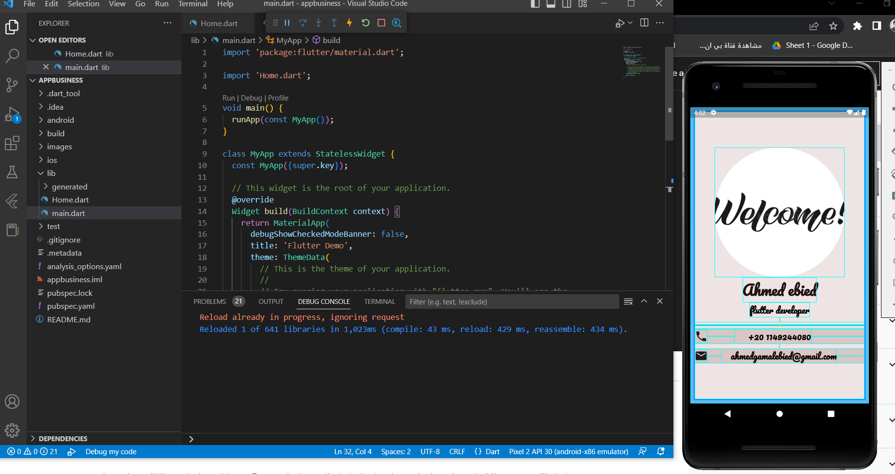

# appbusiness

A new Flutter project.

Simple application to learn
circle image
adding font
spacer widget
divider
const
 

For help getting started with Flutter development, view the
[online documentation](https://docs.flutter.dev/), which offers tutorials,
samples, guidance on mobile development, and a full API reference.
